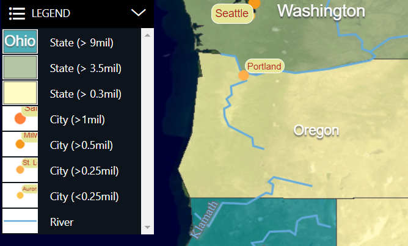
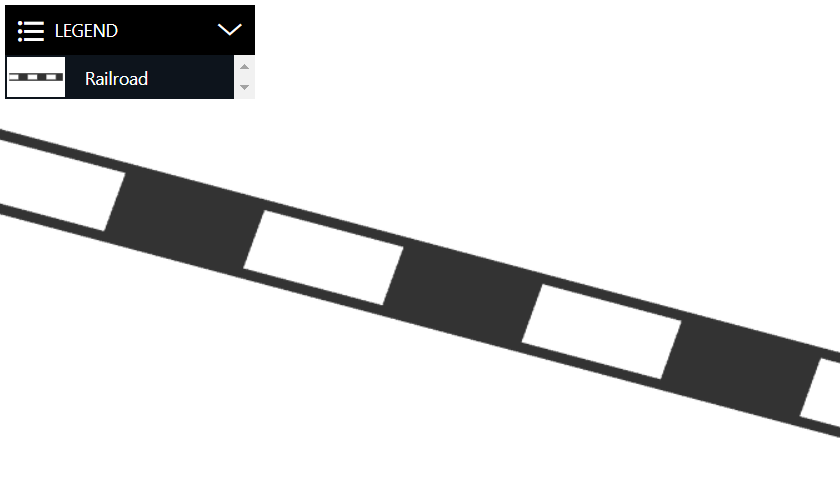

# LuciadRIA Legend tool

This package contains the Legend API.

## Overview

The Legend Support allows users to visualize dynamic legends on top of the map. A dynamic legend only generates legend images for features that are actually visible on the map at its current scale level and given the current layer visibility.

A legend panel could look like this:



## Usage

This tool can help you create features that can serve as entries for your legend. It can also help you render these features into images for a legend table.

### Legend entries

The `LegendSupport`tool helps you create
fitting `LegendEntryInput`. There are utility methods to create legend
entries for points (icons), lines, and areas (zones). You merely have to provide a description to display with the legend entries, and some feature properties that are necessary to generate the correct styling. The methods create the appropriate shapes and take care of unique IDs for all your entries.

```typescript
// Create a new legend entry instance for an icon feature.
const largeCityLegendEntry = createIconLegendEntryInput("Large city", {SCALERANK: 1, NAME: "LA"});
// Create a new legend entry instance for an line feature.
const roadLegendEntry = createLineLegendEntryInput("Road", {NAME: "Interstate Route"});
// Create a new legend entry instance for an area feature.
const lakeLegendEntry = createAreaLegendEntryInput("Lake")
```

### Legend preview

The `LegendPreviewUtil` tool is a class that helps you create the right images for a dynamic map legend. This utility keeps the generated images cached to prevent re-calculation for each map scaling.

You can create a `LegendPreviewUtil` and ask it for legend entry previews like this:

```typescript
const legendPreviewUtil = new LegendPreviewUtil(map);

const width = 60;//px
const height = 40;//px

// Create a legend image for the feature (created using `LegendSupport`) 
// on the given layer with the given painter.
const legendImage: string | null =
    await legendPreviewUtil.getLegendPreview(legendFeature, layer, legendPainter, width, height);
```

If you can change styles on-the-fly, or change scale levels in your application, to re-define at which level certain features appear on the map, you must clear the cache for the affected legend entries.

To clear the cache, use the `resetLegendCache` method from the `legendPreviewUtil`.


## Handling world-sized styling

The Features inside the `LegendEntryInput`, created by the `LegendSupport`, all have a shape (point, polyline or polygon) in a Cartesian 2D reference. That makes it easy for the tool to generate good-looking legend images, but it also means that they can't be styled using world-sized styling.

> **_NOTE:_** World-sized styling in a legend image might not be what you want: when users start zooming in, your feature on the map might become too big to fit into a legend image.

Instead of creating legend Features yourself, with another reference, we recommend that you to create a dedicated legend Painter that overrides all world-sized styling with screen-sized styling.


